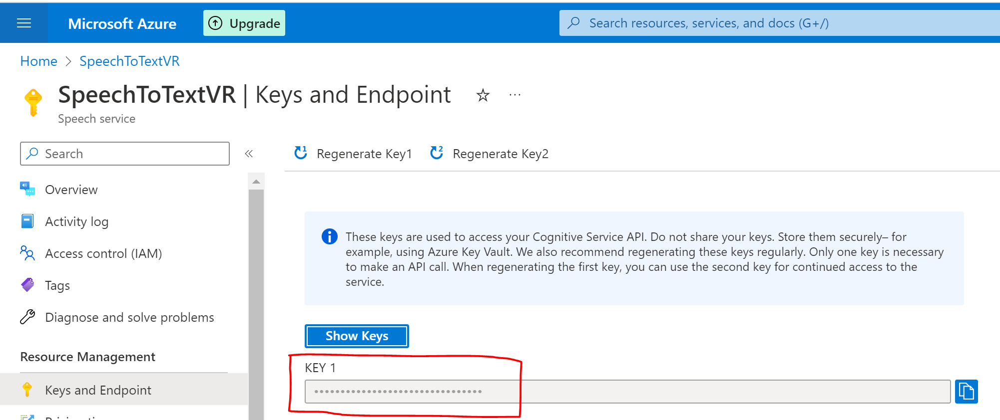
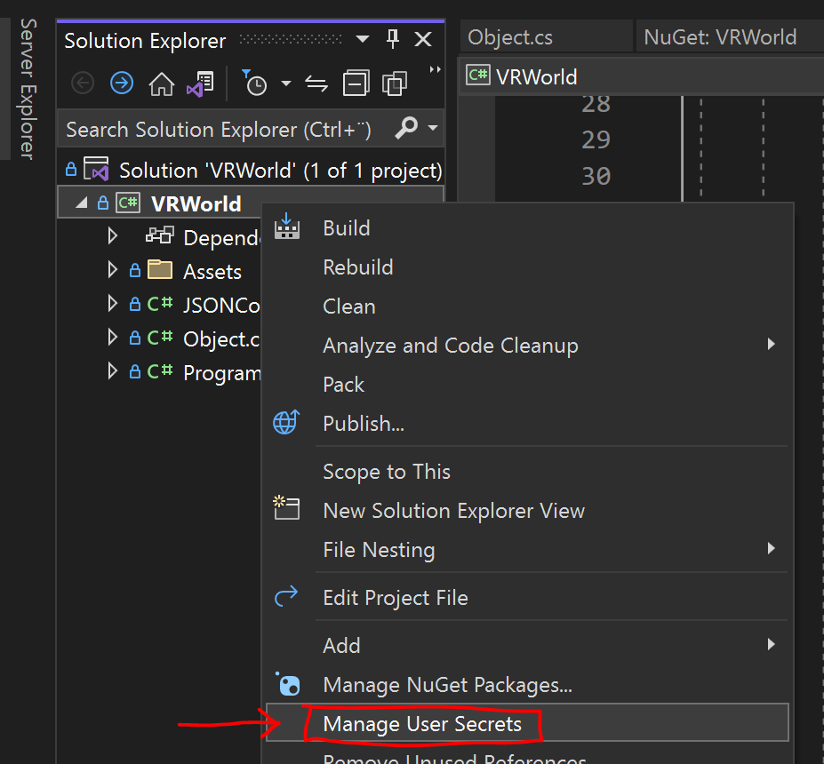

# Create a world with voice commands
My first OpenAI project. I can place objects in the world with my voice.
I'm using "OpenAI Codex" to generate .json and to convert my voice to text I use "Microsoft Azure Speech-To-Text".

[Youtube demo link](https://youtu.be/7q-3J6OqiMY)
[](https://youtu.be/7q-3J6OqiMY "Youtube link to demo")

## How it works
### 1. Create a world
To display the VR world I use the open-source VR game engine StereoKit. Its main programming language is C#. This is just a basic example of how to draw a cube.
```csharp
using StereoKit;

class Program
{
    static void Main(string[] args)
    {
        SK.Initialize(new SKSettings{ appName = "Project" });
        SK.Run(() =>
        {
            Mesh.Cube.Draw(Material.Default, Matrix.S(0.1f));
        });
    }
}
```
### 2. Use the OpenAI API
#### Right prompts
The first thing I have to do is create a start prompt for the AI, which it is going to continue on. In the start prompt you set up the rules for the AI.
```
Create a json block from prompt.
Example:
text:Create a blue cube at position one one one
json:{"id": 0, "position": {"x": 0, "y": 0, "z": -1}, "scale": {"x": 1.0, "y": 1.0, "z": 1.0}, "shape": "cube", "color": {"r": 0.0, "g": 0.0, "b": 1.0}}
text:remove or delete the blue cube
json:{"id": 0, "remove": true}
Real start with id 0:
text:
```
Using [OpenAI playground](https://platform.openai.com/playground) is a good place to test our prompts. I used the Codex Cushman model.
#### API
To use the OpenAI API you first need an API key which can be created under [Personal -> View API keys](https://platform.openai.com/account/api-keys)

Create an `api` object and `async GenerateAIResponce` function which can be run on a different thread. It needs to be run on a different thread so the program doesn't freeze when waiting for a response.
```csharp
var api = new OpenAI_API.OpenAIAPI(openAiKey);

static async Task<CompletionResult> GenerateAIResponce(OpenAI_API.OpenAIAPI anApi, string aPrompt)
{
    var request = new CompletionRequest(
            prompt: aPrompt,
            model: OpenAI_API.Models.Model.CushmanCode,
            temperature: 0.1,
            max_tokens: 256,
            top_p: 1.0,
            frequencyPenalty: 0.0,
            presencePenalty: 0.0,
            stopSequences: new string[] { "text:", "json:", "\n" }
            );
    var result = await anApi.Completions.CreateCompletionAsync(request);
    return result;
}
```
The response you get from OpenAI is a `string` that gets converted to a `JSON object`.  I then read the JSON object values and update the objects. 
```csharp
public void UpdateFromJSON(JObject someData)
{
    someData.TryGetValue("position", out JToken JPos);
    someData.TryGetValue("scale", out JToken JScale);
    someData.TryGetValue("shape", out JToken JShape);
    someData.TryGetValue("color", out JToken JColor);

    //Position
    if (JPos != null)
    {
        myPose.position = JSONConverter.FromJSONVec3((JObject)JPos);
    }
    //Scale
    if (JScale != null)
    {
        myScale = JSONConverter.FromJSONVec3((JObject)JScale);
    }
    //Mesh
    if (JShape != null)
    {
        string str = JShape.ToString();
        myShape = str;

        if (str == "cube")
        {
            myModel = Model.FromMesh(Mesh.Cube, Material.UI);
        }
...
```

### 3. Convert speech to text
To use Microsoft's speech service we first need to create a "Speech Service resource" and get our key.

We then create a `speechRecognizer` and add a lambda expression to the `Recognizing` event. This event is called every time the speech recognizer receives a result.
```csharp
var speechConfig = SpeechConfig.FromSubscription(speechKey, speechRegion);
speechConfig.SpeechRecognitionLanguage = "en-US";

using var audioConfig = AudioConfig.FromDefaultMicrophoneInput();
using var speechRecognizer = new SpeechRecognizer(speechConfig, audioConfig);

speechRecognizer.Recognizing += (s, e) =>
{
    speechAIText = e.Result.Text;
};
```
Start the speech recognition by calling:
```csharp
speechRecognizer.StartContinuousRecognitionAsync().Wait();
```
And to end the speech recognition call:
```csharp
speechRecognizer.StopContinuousRecognitionAsync().Wait();
```

## Store out keys securely with "Visual Studio user secrets"
Don't store your keys in the Git project and accidentally push them to Github! Visual Studio user secrets is a JSON file stored in a different folder than the project on your local PC.
Go to `Solution Explorer -> Manage User Secrets` and add your keys to the JSON file.
```json
{
  "OPENAI_API_KEY": "xxxxxxxxxxxxxxxxxx",
  "SPEECH_KEY": "xxxxxxxxxxxxxxxxx",
  "SPEECH_REGION": "xxxxxxxxxxx"
}
```



We can then load in our keys by calling:
```csharp
var config = new ConfigurationBuilder().AddUserSecrets<Program>().Build();
string openAiKey = config.GetSection("OPENAI_API_KEY").Value;
string speechKey = config.GetSection("SPEECH_KEY").Value;
string speechRegion = config.GetSection("SPEECH_REGION").Value;
```

## Packages that are used
- [StereoKit](https://github.com/StereoKit/StereoKit) which is an open-source VR game engine
- [OpenAI API C#/.NET](https://github.com/OkGoDoIt/OpenAI-API-dotnet) wrapper to make API calls to Open AI
- [Microsoft Azure Speech to text](https://learn.microsoft.com/en-us/azure/cognitive-services/speech-service/) to make API calls to to convert speech to text
- [Newtonsoft](https://www.newtonsoft.com/json) which is a JSON framework

## NuGet links
- [StereoKit](https://www.nuget.org/packages/StereoKit)
- [OpenAI C#/.Net](https://www.nuget.org/packages/OpenAI/)
- [Microsoft Azure Speech to text](https://www.nuget.org/packages/Microsoft.CognitiveServices.Speech/)
- [Newtonsoft](https://www.nuget.org/packages/Newtonsoft.Json)